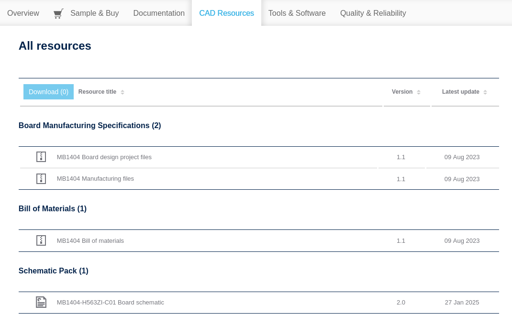

# 🧩 Conoce tu Tarjeta

[(Volver al Indice)](https://github.com/JossueE/Mastering-STM32/tree/main?tab=readme-ov-file#%C3%ADndice)

---

Antes de comenzar tu primer proyecto, es importante que obtengas información sobre la **tarjeta de desarrollo** con la que vas a trabajar.  
Conocer los documentos técnicos y componentes de tu placa te permitirá **entender las configuraciones de hardware**, los periféricos disponibles y las **limitaciones eléctricas** de cada pin. 

---

## Documentos esenciales

Cada tarjeta STM32 (NUCLEO, DISCOVERY, EVAL o DISCO) cuenta con **documentación oficial** publicada por STMicroelectronics.  
Estos archivos son fundamentales para entender cómo está construida la placa y cómo se comunica con el microcontrolador.

| Documento | Descripción |
|------------|--------------|
| **Datasheet** | Especificaciones eléctricas y mecánicas del microcontrolador (voltaje, memoria, periféricos, encapsulado). |
| **Reference Manual** | Explica en detalle el funcionamiento interno de los módulos y registros. |
| **User Manual (UM)** | Describe la tarjeta de desarrollo (NUCLEO o DISCOVERY): conexiones, jumpers, ST-LINK, LEDs, botones, etc. |
| **Schematics** | Diagrama eléctrico completo de la placa (útil para entender conexiones internas). | 

Para poder obtenerlos debes acceder a la página oficial [www.st.com](https://www.st.com/en/evaluation-tools/nucleo-h563zi.html#overview) en este caso el link te lleva a la tarjeta que estamos usando para este curso. En el caso de que estes trabajando sobre otra placa de desarrollo, escribe el modelo en el buscador propio de la página. 

Dirígete a la pestaña de CAD Resources, ahí encontrarás todos los documentos relacionados a tu placa. Puedes descargar todos si así lo deseas, pero yo te recomiendo comenzar solo con los que corresponden a `Schematic Pack`.

  
   
  <em>Pestaña CAD Resources</em>

  

Para este curso trabajaremos con la librería **HAL** (*Hardware Abstraction Layer*) de STM. Es por así decirlo una manera de simplificar procesos en nuestro microcontrolador, es muy útil para la mayoría de proyectos y en la mayoría de aplicaciones industriales. Sin embargo, si tu intención es dedicarte de manera seria a la ingeniería embebida. A nivel profesional en algunos sectores no se recomienda su uso y tampoco se pide. Pero es la mejor manera de introducirse a lo microcontroladores STM32 por si en un futuro te gustaría seguir desarrollandote.

No he encontrado la documentación de la librería HAL para la tarjeta NUCLEO-H563ZI pero dejo la documentación de la familia NUCLEO-H7*** que es muy semejante. Te recomiendo descargarla. [Doc. Librería HAL STM](https://www.st.com/resource/en/user_manual/dm00392525-description-of-stm32h7-hal-and-lowlayer-drivers-stmicroelectronics.pdf)

> [!TIP]  
> Guárdalos en una carpeta dentro de tu workspace, por ejemplo:  
> `Documents/STM32/NUCLEO-H563ZI/Documentation/`  
> Esto te permitirá consultarlos rápidamente al diseñar o depurar proyectos.

---

Si abriste el archivo y descubriste que **no entiendes nada**, no te preocupes. Lo iremos revisando poco a poco durante el curso.
Se trata de un **esquemático**, un documento muy utilizado en electrónica que actúa como un mapa o manual visual para entender cómo está conectada la placa y por qué se hicieron esas conexiones.

Gracias a él, si en el futuro alguien quisiera usar solo una parte de la placa, bastará con revisar esa sección y copiarla.
Y si tienes dudas sobre una conexión o un componente, puedes consultarlo directamente en la guía del fabricante, sin necesidad de adivinar ni depurar.

Todos los microcontroladores y placas de desarrollo —como **Arduino** o **ESP32**— cuentan con su propio esquemático, aunque quizá hasta ahora no habías tenido la necesidad de usarlo.

[(Ver siguiente capítulo: Iniciar un Proyecto)](../../Files/iniciar_proyecto/iniciar_un_proyecto.md)