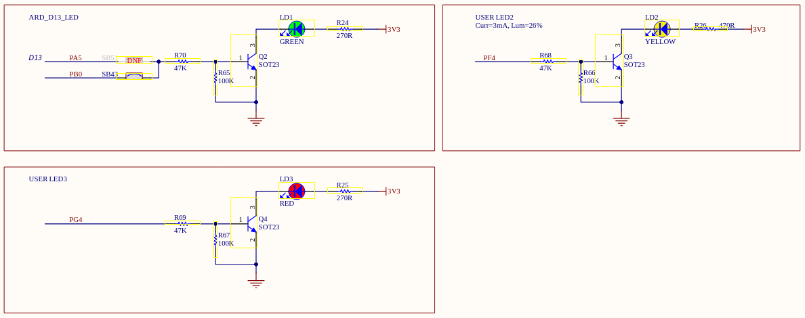
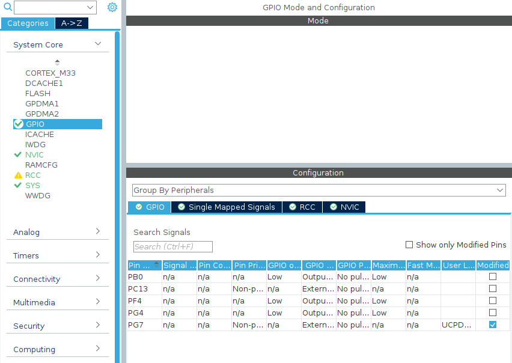
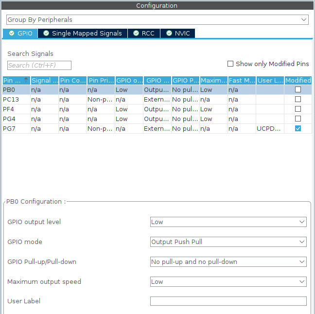
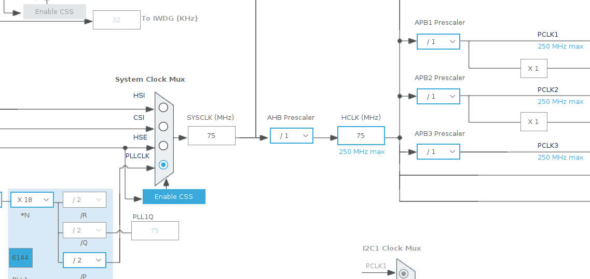
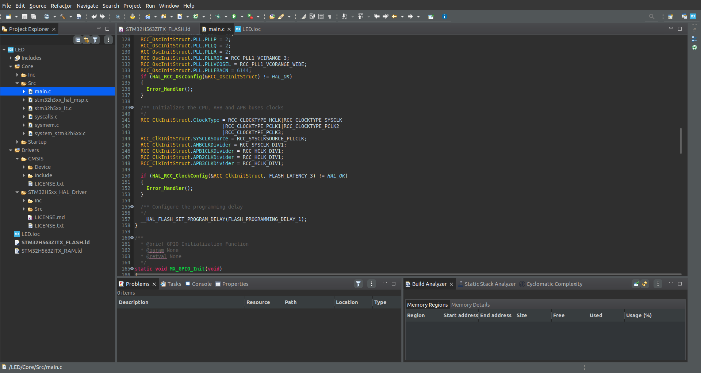

# ⚡ GPIO — Entradas y Salidas Digitales

[(Volver al Índice)](https://github.com/JossueE/Mastering-STM32/tree/main?tab=readme-ov-file#%C3%ADndice)

---


## 📘 Introducción

Los **GPIO** (*General Purpose Input/Output*) son pines configurables del microcontrolador que pueden actuar como **entradas** o **salidas digitales**.  
Son la base de toda interacción con el mundo físico: encender un LED, leer un botón, controlar un motor o recibir una señal externa.

Cada pin puede cumplir múltiples funciones dependiendo de su configuración en el archivo `.ioc`:
- **GPIO Input:** para leer señales digitales (como botones o sensores).
- **GPIO Output:** para enviar señales (como encender un LED).
- **Alternate Function (AF):** cuando el pin se asocia a un periférico (UART, SPI, I²C, PWM, etc.).
- **Analog:** para entradas analógicas (ADC, DAC).

---


## 📖 Partes del Capítulo

- [🧠 1. Conceptos básicos de GPIO](#1-conceptos-básicos-de-gpio)
- [💡 2. Práctica]()
    - [Encender un LED de la Tarjeta]()
    - [Encender un LED Externo]
    - [Leer el Botón de Usuario]
- [🔁 3. Combinando LED + Botón](#4-combinando-led--botón)
- [⚙️ 5. Buenas prácticas y notas finales](#5-buenas-prácticas-y-notas-finales)

---


## 🧠 1. Conceptos básicos de GPIO

| **Modo**                                       | **Descripción detallada**                                                                                                                                                                                                                                                                                                 |
| ------------------------------------------------- | ---------------------------------------------------------------------------------------------------------------------------------------------------------------------------------------------------------------------------------------------------------------------------------------------------------------------------- |
| **Input (Entrada)**                               | El pin actúa como receptor de señales digitales externas. Detecta si la entrada está en nivel lógico **bajo (0 V)** (*Pull-down*) o **alto (3.3 V)** (*Pull-up*). Se usa para **botones, interruptores o sensores** que envían una señal al microcontrolador.                                                                                          |
| **Output Push-Pull (Salida tipo empuje-tiro)**    | El pin puede **proporcionar** corriente (estado alto) o **absorberla** (estado bajo). Es el modo más común para **encender LEDs, controlar relés o enviar señales digitales**, ya que el pin conmuta directamente entre 0 V y 3.3 V.                                                                                         |
| **Output Open-Drain (Salida de drenaje abierto)** | El pin **solo puede llevar la señal a 0 V (bajo)**; cuando está en alto, **queda en alta impedancia**, por lo que necesita una **resistencia externa “pull-up”** para marcar el nivel alto. Es útil en **buses compartidos** como **I²C** o cuando varios dispositivos deben controlar una misma línea.                      |
| **Pull-up / Pull-down (Resistencias internas)**   | Son resistencias integradas que se pueden activar por software para fijar el estado de un pin **cuando está desconectado** o sin señal externa. <br>• *Pull-up:* mantiene el pin en nivel alto (1) por defecto. <br>• *Pull-down:* mantiene el pin en nivel bajo (0) por defecto. <br>Evitan lecturas erráticas o flotantes. |
| **Alternate Function (AF) (Función alternativa)** | Permite que el pin deje de ser un GPIO genérico y se asigne a un **periférico interno del microcontrolador**, como **USART, SPI, I²C, PWM, CAN o TIMERS**. Cada pin puede tener hasta 16 funciones alternas posibles, dependiendo del modelo del STM32.                                                                      |

## 💡 2. Práctica

Ahora si, con todo lo visto anteriormente. Estás preparado para hacer tu primer script funcional. 

### Encender un LED de la Tarjeta

1. Crearemos un proyecto nuevo con lo visto anteriormente [Configuración de tu Tarjeta](../../Files/iniciar_proyecto/iniciar_un_proyecto.md), seguiremos los pasos hasta llegar al punto 13 y en lenguaje de programación escogeremos C. Deberíamos llegar a esta Pantalla.

<p align="center">
  
  <br>
  <em>Pinout & Configuration</em>
</p>

2. Ahora necesitaremos los esquemáticos obtenidos previamente en [Conociendo tu Tarjeta](../../Files/Conoce_tu_placa/conoce_tu_placa.md), para esta práctica usaremos los LEDs de Usuario que trae por defecto la tarjeta NUCLEO-H563ZI que es la que estoy usando para este curso. 

Debemos encontrar algo así

<p align="center">
  
  <br>
  <em>LEDs de Usuario de la Tarjeta NUCLEO-H563ZI</em>
</p>

> [!NOTE]
> En caso de que tu placa **NO con cuente con LEDs de usuario** te sugiero saltar al siguiente ejercicio, donde evaluaremos cómo hacerlo con un LED externo.


3. Cuando miras un esquemático como el que tienes, es importante entender el modo en que el LED está conectado al microcontrolador: si se ilumina cuando el pin del micro está en nivel alto (3.3 V) o cuando está en nivel bajo (0 V). Esto se conoce como **active-high** o **active-low**. En este caso los 3 LEDs **se encuentran en modo active-high** es decir activos en 1.

> [!TIP]
> Si todavía no eres capaz de identificarlo, te recomiendo validarlo con un Agente de IA como chatgpt. 
> También puedes revisar esta referencia que aplica para este caso en concreto. [Qué es y cómo funciona un transistor](https://youtu.be/2oFSpaILPi0?si=Kyvuc1P4KBJLYeha)


4. Para este ejercicio, necesitaremos el PIN que corresponde a cada LED, es por ello que necesito que los anotes. Para la tarjeta en este caso son PG4 para el LED rojo, PA5 o PB0 para el verde y PF4 para el amarillo.

5. En el lado izquierdo de tu IDE, en la sección Categories. Selecciona `System Core` y `GPIO`. En ella podrás observar que el nombre de los PINEs ya se encuentra enlistado. 

<p align="center">
  
  <br>
  <em>Vista de GPIO en System Core</em>
</p>

> [!NOTE]
> En caso de que no lo veas, deberás acercarte al pin en específico en tu `Pinout View` y definirlo como `GPIO_output` con click izquierdo
> Si tienes dudas, revisa el capítulo [Configuración de tu Tarjeta](../../Files/iniciar_proyecto/iniciar_un_proyecto.md).

6. Ahora da click sobre los pines asignados a los LED. Se desplegará la pestaña de Configuración. 

| **Elemento**              | **Descripción**                                                                                                                                                                                              |
| ---------------------------- | --------------------------------------------------------------------------------------------------------------------------------------------------------------------------------------------------------------- |
| **Pin**                      | Muestra el nombre físico del pin del microcontrolador (por ejemplo, `PB0`, `PC13`, `PF4`, etc.).                                                                                                                |
| **Signal**                   | Indica la función asignada al pin (GPIO, USART_TX, SPI_MOSI, etc.). Si aparece como `n/a`, el pin actúa como GPIO general.                                                                                      |
| **GPIO Output Level**        | Define el **estado inicial** del pin al iniciar el programa: <br>• *Low:* el pin arranca en nivel lógico bajo (0 V). <br>• *High:* el pin arranca en nivel lógico alto (3.3 V).                                 |
| **GPIO Mode**                | Determina el **comportamiento eléctrico** del pin: <br>• *Input*, *Output Push-Pull*, *Output Open-Drain*, *Alternate Function*, *Analog*.                                                                      |
| **GPIO Pull-up / Pull-down** | Activa las **resistencias internas** del microcontrolador: <br>• *No pull-up and no pull-down* → el pin queda flotante. <br>• *Pull-up* → mantiene el pin en alto. <br>• *Pull-down* → mantiene el pin en bajo. |
| **Maximum Output Speed**     | Controla la **velocidad de conmutación** del pin (no el tiempo de ejecución): <br>• *Low* → ideal para GPIO comunes (LEDs, pulsadores). <br>• *Medium / High / Very High* → para señales rápidas (SPI, PWM).    |
| **User Label**               | Permite asignar un **nombre descriptivo** al pin (por ejemplo, `LED_VERDE` o `BOTON_USER`) para usarlo más fácilmente en el código.                                                                             |
| **Modified (☑)**             | Indica si el pin ha sido **editado o configurado manualmente** por el usuario. STM32CubeIDE marca automáticamente los pines modificados.                                                                        |

> [!NOTE]
> Si estas trabajando con un micro que tiene `Dual Core`, aparecerá una categoría `Context Assigment`, en la cual deberás seleccionar el núcleo sobre el cuál quieras trabajar. 

<p align="center">
  
  <br>
  <em>Pestaña de Configuration</em>
</p>

7. En `GPIO output level`, elige `Low` (Esto implica que empezará en estado bajo)
8. En `GPIO mode` elige `output push pull` 
9. En `GPIO Pull-up/Pull-down` elige `No pull-up and no pull-down`
10. En `Max. Output Speed` elige `High`
11. En `User Label` escribe `LD1` (para el LED 1)
    Para el LED2 = escribe `LD2`
    Para el LED3 = escribe `LD3`

12. Repite lo anterior para todos lo LED, si lo hiciste bien. Verás el `User Label`correspondiente en cada PIN en la representación visual.
13. Ahora dirígete a la Pestaña `Clock Configuration`, deberás ver algo parecido a esto.

<p align="center">
  
  <br>
  <em>Pestaña Clock Configuration</em>
</p>

14. En el campo central se encuentra la frecuencia de tu reloj, en mi caso es 250MHz. Para esta práctica lo cambiaremos a 75Mhz.
Cuando modifiques el valor, notarás como los valores de hasta el final se ven actualizados. 

<p align="center">
  
  <br>
  <em>Pestaña Clock Configuration con CLK Ajustado</em>
</p>

15. Guarda tu archivo con la clave `Ctrl + Shift + S`
16. Te pedirá si quieres crear tu código. Dale que `Sí`
17. En el caso de que no aparezca códigos o no veas archivos generados a la izquierda, revisa el contenido del capítulo [Iniciar Proyecto: Generar Código](https://github.com/JossueE/Mastering-STM32/blob/main/Files/iniciar_proyecto/iniciar_un_proyecto.md#%EF%B8%8F-4-generar-el-código)

18. Dirígete al Archivo `main.c` si te parece abrumador ver tantos archivos. O código que no entiendes, revisa el capítulo [Iniciar Proyecto: Conoce tu Espacio de Trabajo](https://github.com/JossueE/Mastering-STM32/blob/main/Files/iniciar_proyecto/tu_espacio_trabajo.md) en el cuál te doy una explicación rápida de lo que ves y las herramientas que utilizaremos. 

<p align="center">
  
  <br>
  <em>Primera vistaso de main.c</em>
</p>

19. Abre tu documentación de la librería HAL, que debiste haber descargado junto a los esquemáticos en [Conoce tu Tarjeta (Como Obtener los Esquemáticos)](https://github.com/JossueE/Mastering-STM32/blob/main/Files/Conoce_tu_placa/conoce_tu_placa.md#-conoce-tu-tarjeta) por qué lo necesitarás. 

20. Para el ejercicio escribiremos un código que encienda los tres LEDs intercalando sus estados con un delay de 1 segundo entre cada LED.

21. Para ello iremos a nuestro manual de la librería HAL, obtenido en el punto anterior, buscaremos la función HAL_GPIO_TogglePin y HAL_Delay. Veremos cuáles son los valores que se necesitan y cómo configurarlos. 

22. En este ejercicio yo te daré el código mínimo y la explicación para que aprendas como funciona. 

```C

  // Loop Principal
  while (1)
  {
    /* USER CODE END WHILE */
    HAL_GPIO_TogglePin (GPIOB, LD1_Pin);
    HAL_Delay (1000);
    HAL_GPIO_TogglePin (GPIOF, LD2_Pin);
    HAL_Delay (1000);
    HAL_GPIO_TogglePin (GPIOG, LD3_Pin);
    HAL_Delay (1000);

    /* USER CODE BEGIN 3 */
  }

``` 

Si observas, para definir un **GPIO** utilizamos primero el **puerto** por el cual está asignado nuestro **pin** y luego el **nombre** correspondiente de dicho pin. Para identificar correctamente el puerto y saber cómo escribirlo, debemos consultar el **esquemático** obtenido en el **Punto 2** de este ejercicio.

En dicho esquema podemos ver pines como **PB0**, **PF4** o **PG4**. La nomenclatura sigue una estructura simple: la letra **P** indica **Port**, seguida de una **letra (B, F o G)** que identifica el **puerto**, y finalmente el número del pin.

Cuando asignamos un **nombre de usuario (User Label)** a cada pin —como se indica en el **Punto 11** del ejercicio—, ese nombre reemplaza el valor predeterminado en el código. Esto puede verificarse fácilmente en el código generado: al revisar cómo se inicializa un pin con un User Label asignado y cómo se ve cuando no lo tiene.

``` C
/*Configure GPIO pin : PC13 */
GPIO_InitStruct.Pin = GPIO_PIN_13;
GPIO_InitStruct.Mode = GPIO_MODE_IT_RISING;
GPIO_InitStruct.Pull = GPIO_NOPULL;
HAL_GPIO_Init(GPIOC, &GPIO_InitStruct);

/*Configure GPIO pin : LD2_Pin */
GPIO_InitStruct.Pin = LD2_Pin;
GPIO_InitStruct.Mode = GPIO_MODE_OUTPUT_PP;
GPIO_InitStruct.Pull = GPIO_NOPULL;
GPIO_InitStruct.Speed = GPIO_SPEED_FREQ_HIGH;
HAL_GPIO_Init(LD2_GPIO_Port, &GPIO_InitStruct);
``` 


