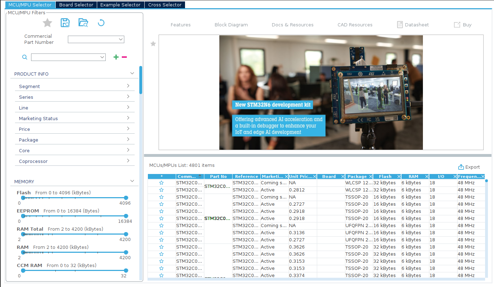
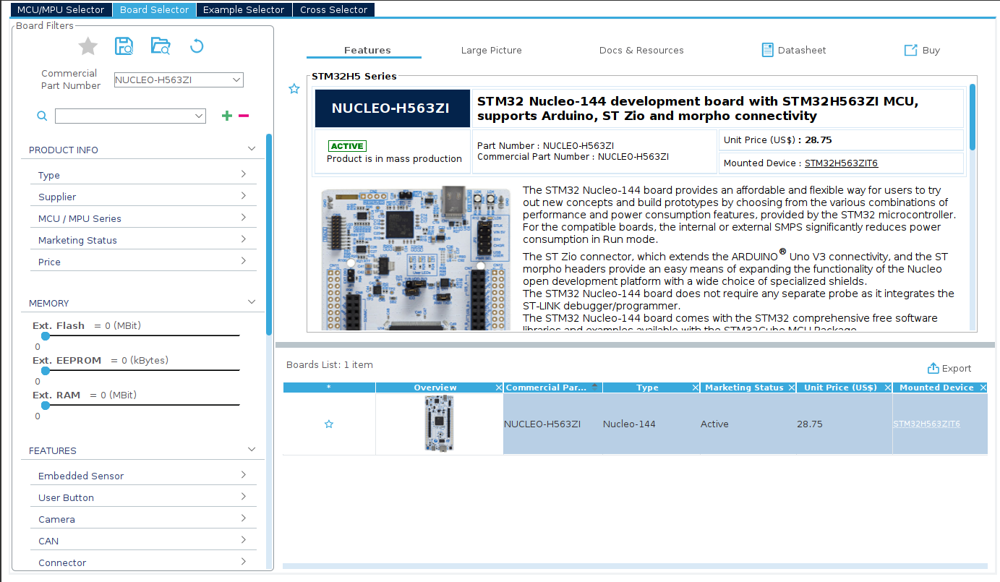
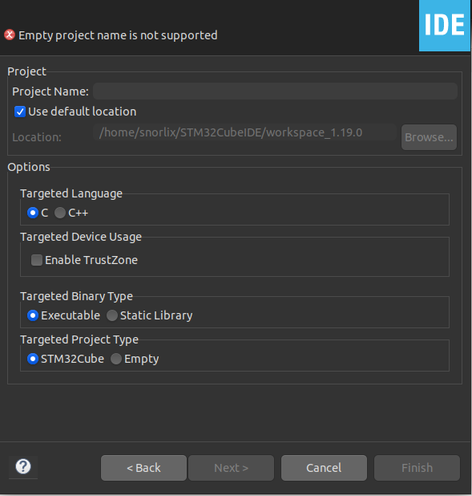
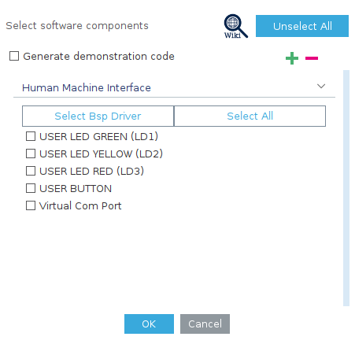
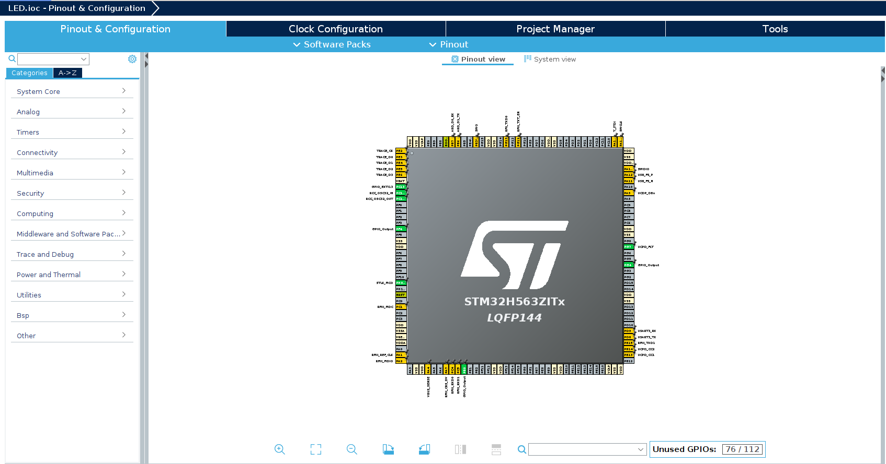
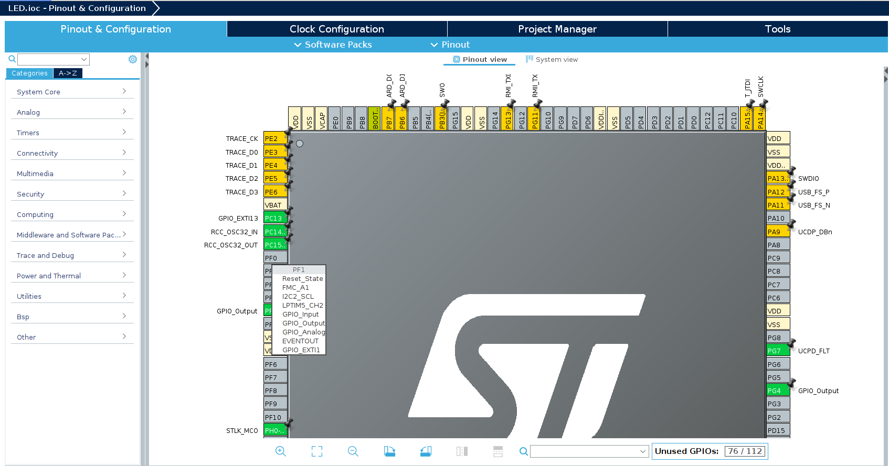
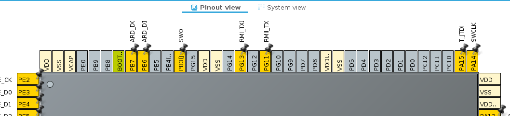
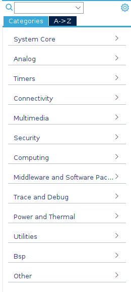
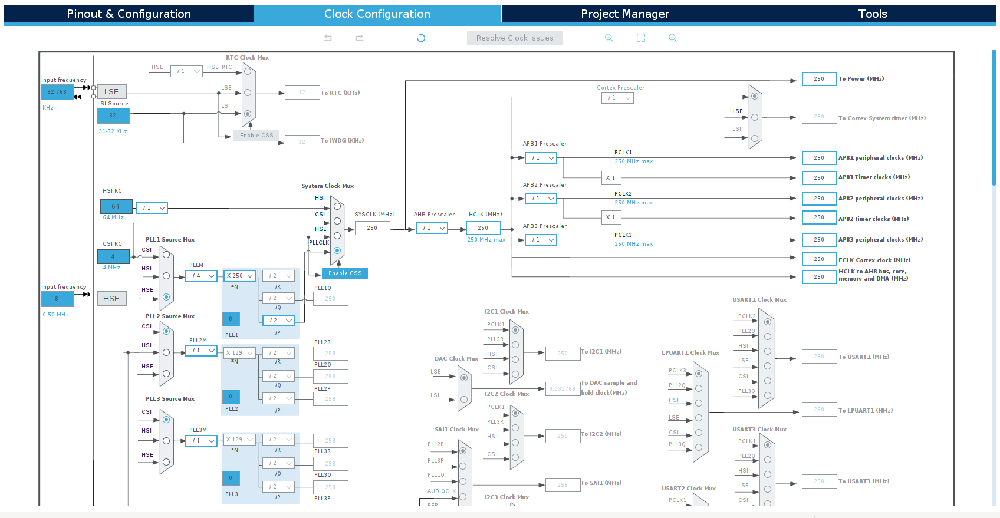
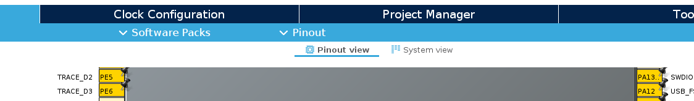

# 🔨 Configura tu Tarjeta

[(Volver al Indice)](https://github.com/JossueE/Mastering-STM32/tree/main?tab=readme-ov-file#%C3%ADndice)

---

Una vez que hayas definido tu **workspace**, podemos comenzar a construir tu **primer proyecto con STM32CubeIDE**.  
En esta sección aprenderás a crear un nuevo proyecto desde cero, seleccionar el microcontrolador o placa de desarrollo, configurar los periféricos básicos y conocer tu entorno de trabajo.

---

## 📖 Partes del Capítulo

- [🧱 1. Crear un nuevo proyecto](#-1-crear-un-nuevo-proyecto)
- [🧭 2. Explorando la Ventana .ioc - Pinout & Configuration](#-2-explorando-la-ventana-ioc---pinout--configuration)
- [⏱️ 3. Explorando la pestaña Clock Configuration](#%EF%B8%8F-3-explorando-la-pesta%C3%B1a-clock-configuration)
- [✏️ 4. Generar el Código](#%EF%B8%8F-4-generar-el-código)

---

## 🧱 1. Crear un nuevo proyecto

1. Con **STM32CubeIDE** abierto y el workspace seleccionado.  
2. En la barra superior izquierda, selecciona:  
   **File → New → STM32 Project**
3. Se abrirá una ventana llamada **Target Selection**. Aquí podrás elegir:
   - Tu **placa NUCLEO** (por ejemplo: `NUCLEO-H563ZI`)  
   - O directamente el **microcontrolador** (por ejemplo: `STM32H563ZITx`)

  
   
  <em>Ventana Target Selection</em>

  

---

4. Dirígete a la ventana `Board Selector` y en `Commercial Part Number` coloca el nombre de tu placa. 

  
   
  <em>Ventana Board Selection</em>

  

---

5. Una ves encontrada seleccionala. 

> [!TIP]
> Te recomiendo darle a favoritos con el ícono de la ⭐ porque tendrás que usarla de manera recurrente.

6. Selecciona Next
7. Se abrirá una nueva pestaña en la que deberá definir el nombre de tu proyecto. 
8. Verifica que `Use default location` se encuentre activada, esto almacenará la información en tu workspace.
9. Selecciona el lenguaje en el que deseas programar, ya sea C++ o C.
10. Verifica que en las opciones se encuentre como archivo `Executable` 
11. Presiona `Finish`.

  
   
  <em>Ventana de Configuración</em>

  

---

12. Selecciona `Disable All` o `Unselect All` y selecciona `Next`

  
   
  <em>Ventana de Opciones</em>

> [!NOTE]
> Las definiciones necesarias para tu tarjeta de desarrollo específica se comenzarán a descargar. El tamaño de la descarga es de aproximadamente 1GB.
> Esta esla única vez que tendrás que realizar esta descarga.

---

13. Al terminar podrás ver una representación gráfica del microcontrolador integrado en tu tarjeta.

  
   
  <em>Representación Gráfica del Micro</em>

## 🧭 2. Explorando la Ventana .ioc - Pinout & Configuration

---

1. Al hacer `Zoom In` podrás ver que cada pin tiene un color diferente.

| Color       | Significado                                                     | Ejemplo                         |
| ----------- | --------------------------------------------------------------- | ------------------------------- |
| ⚪ Gris    | Pin **no asignado** (disponible).                               | Sin función seleccionada.       |
| 🟡 Amarillo | Pin **configurado por el usuario** (GPIO, o periférico simple). | PB0 → GPIO_Output (LED).        |
| 🟢 Verde    | Pin **asignado automáticamente a un periférico**.               | USART2_TX, I2C1_SCL, SPI1_MISO. |
| 🔵 Azul     | Pin **usado por una función fija del sistema**.                 | Reset, Vref, NRST, OSC_IN.      |
| 🔴 Rojo     | **Conflicto o error** (dos funciones usan el mismo pin).        | SPI1 y USART2 en el mismo pin.  |
| 🟣 Morado   | **Función alternativa activa (Alternate Function)**.            | PWM, I²C, SPI, UART, TIM.       |

---

2. Si das `Click Izquierdo` sobre cualquier pin, verás las funciones que cada uno puede obtener.

  
   
  <em>Funciones de cada pin</em>

 ---

 3. En el IDE, sobre el microcontrolador encontrarás dos pestañas: `Pinout view` y `System view`.
 - **Pinout view** da la vista previa al microcontrolador.
 - **System view** proporciona un resumen de todos los sistemas habilitados hasta el momento.

  
   
  <em>Pinout view y System view</em>

---
4. A la izquierda del microcontrolador encontrarás el panel **Categories**, que agrupa todos los periféricos y módulos del STM32 organizados por tipo de funcionalidad.  

Desde aquí puedes activar o desactivar periféricos, configurar pines, y habilitar controladores de hardware según las necesidades de tu proyecto. Para ello cuentas con la pestaña `Mode` y `Configuration` que se mostraran automáticamente cuando actives algun elemento de las categorías.

| Categoría | Descripción breve |
|------------|------------------|
| **System Core** | Configuración principal del microcontrolador: reloj, interrupciones, GPIO, DMA, NVIC, etc. |
| **Analog** | Periféricos analógicos como ADC, DAC o comparadores. |
| **Timers** | Control de tiempo, generación de PWM o captura de señales. |
| **Connectivity** | Comunicación con otros dispositivos: UART, SPI, I²C, CAN, USB, Ethernet, etc. |
| **Multimedia** | Periféricos gráficos o de audio, como LCD, DCMI, o SAI (solo en ciertos modelos). |
| **Security** | Módulos de seguridad como AES, RNG, o TrustZone. |
| **Computing** | Aceleradores matemáticos, CRC o FPU. |
| **Middleware and Software Packages** | Librerías adicionales: FreeRTOS, USB Stack, FatFS, LWIP, etc. |
| **Trace and Debug** | Opciones para depuración: SWD, ITM, ETM, o semihosting. |
| **Power and Thermal** | Configuración de modos de bajo consumo o gestión térmica. |
| **Utilities / BSP / Other** | Herramientas y configuraciones específicas de placa. |

> [!NOTE]
> No te preocupes si algunas de estas categorías aún no te resultan familiares.  
> A lo largo del curso iremos explorando cada una de ellas en el contexto de la **tecnología o periférico correspondiente** (por ejemplo, *Timers* cuando hablemos de **PWM**, *Connectivity* cuando configuremos **UART o SPI**, etc.).

  
   
  <em>Panel Categories</em>

---

## ⏱️ 3. Explorando la pestaña Clock Configuration

Una vez configurados los periféricos en la ventana **Pinout & Configuration**, la siguiente pestaña —**Clock Configuration**— te permite visualizar y ajustar las **frecuencias internas del sistema**.  
En otras palabras, aquí defines **a qué velocidad correrá tu microcontrolador** y cómo se distribuyen los relojes hacia cada periférico.

 **Propósito principal:**  
Asegurar que todos los módulos del sistema (núcleo, buses, periféricos) funcionen dentro de los límites de frecuencia recomendados.

| Elemento | Descripción |
|-----------|-------------|
| **HSE (High Speed External)** | Fuente externa de reloj, normalmente un cristal de 8 MHz o un generador conectado al pin HSE. |
| **HSI (High Speed Internal)** | Reloj interno del microcontrolador (típicamente 64 MHz en series H5/H7). |
| **LSE / LSI** | Relojes de baja frecuencia usados por el RTC o watchdog. |
| **PLL (Phase Locked Loop)** | Multiplicadores de frecuencia que permiten obtener velocidades más altas (por ejemplo, 250 MHz a partir de un HSE de 8 MHz). |
| **System Clock Mux (SYSCLK)** | Selecciona la fuente principal de reloj del sistema (HSI, HSE o PLL). |
| **Prescalers (AHB, APB1, APB2, APB3)** | Dividen la frecuencia del sistema para alimentar buses o periféricos con relojes más lentos. |
| **Output Clocks** | Muestran las frecuencias finales a las que operan los periféricos (TIM, USART, I²C, etc.). |

> [!NOTE]
> No te preocupes si algunas de estas categorías aún no te resultan familiares.  
> A lo largo del curso iremos explorando cada una de ellas en el contexto de la **tecnología o periférico correspondiente** (por ejemplo, *Timers* cuando hablemos de **PWM**, *Connectivity* cuando configuremos **UART o SPI**, etc.).

  
   
  <em>Pestaña Clock Configuration</em>

El valor central que aparece en la pestaña **Clock Configuration** representa la **frecuencia principal del sistema (SYSCLK)**, es decir, la velocidad a la que el microcontrolador ejecuta sus instrucciones.

Cambiar esta frecuencia permite ajustar el rendimiento y el consumo energético del microcontrolador según las necesidades del proyecto:

| Frecuencia          | Ventajas                                                                                                            | Desventajas                                                          |
| ------------------- | ------------------------------------------------------------------------------------------------------------------- | -------------------------------------------------------------------- |
| **Alta (250 MHz)**  | Mayor velocidad de ejecución, ideal para tareas exigentes (procesamiento de señales, RTOS, comunicaciones rápidas). | Mayor consumo de energía y generación de calor.                      |
| **Media (75 MHz)**  | Suficiente para proyectos básicos (GPIO, PWM, UART, sensores), con un consumo reducido.                             | Menor rendimiento en operaciones intensivas.                         |
| **Baja (< 25 MHz)** | Mínimo consumo, ideal para modos de bajo poder o proyectos portátiles.                                              | Ejecución lenta, no adecuada para aplicaciones con tiempos críticos. |

Cuando cambias la frecuencia (por ejemplo, de **250 MHz a 75 MHz**), **STM32CubeIDE** recalcula automáticamente los relojes derivados (buses, periféricos, timers, ADC, etc.), ajustando todos los divisores y prescalers del sistema.

[!NOTE]
> Más adelante, cuando implementes **Timers, ADC o PWM**, verás cómo esta frecuencia del sistema influye directamente en la precisión temporal y las tasas de muestreo.

---

## ✏️ 4. Generar el Código
Una vez configuradas las funciones de nuestro micrcontrolador. Podemos Crear nuestro código con los parámetros configurados. Para ello presionaremos `Ctrl + Shift + S`.

Nos preguntará si queremos generar nuestro código. A lo que deberemos responder que `Sí`. Selecciona la misma opción cuando te pregunte si deseas asociar tu proyecto con una perspectiva de C/C++.

> [!IMPORTANT]
> Si NO se generan estos archivos a la Izquierda o no ha cambiado nada, algo anda mal. 

  
   
  <em>Archivos Generados Tras Guardar</em>

Eso significa que algunos paquetes no fueron descargados de manera automática cuando seleccionaste tu placa.
Para arreglarlo dirígete a `Software Packs` luego `Select Components` y finalmente instala todo lo que aparezca con la etiqueta **install**.

  
   
  <em>Software Packs</em>

> [!NOTE]
> Es importante que hayas iniciado sesión como te lo indiqué anteriormente. Caso contrario no podrás instalarlos. 

---

> [!NOTE]
> Te daré la confguración específica para cada función como: GPIO, ADC, UART, etc. 
> En el capítulo correspondiente, así que no corras prisa, que lo revisaremos.

Con esto ya cuentas con una base sólida para **crear y configurar tu primer proyecto** en STM32CubeIDE.
Si has seguido los capítulos paso a paso, habrás notado que **aún no hemos entrado directamente en la interfaz de código**; esto es intencional, ya que primero necesitamos comprender la estructura del entorno y la lógica detrás de la configuración del microcontrolador.

En el siguiente capítulo exploraremos nuestro lugar de trabajo, te daré una explicación rápida de las secciones más importantes y como utilizarlas. 

En el siguiente capítulo exploraremos los **GPIO (General Purpose Input/Output)** y aprenderás a interactuar con el mundo físico mediante un pequeño demo práctico desde tu microcontrolador STM32. 💡

[(Ir al siguiente capítulo: Tu Espacio de Trabajo)](../../Files/iniciar_proyecto/tu_espacio_trabajo.md)