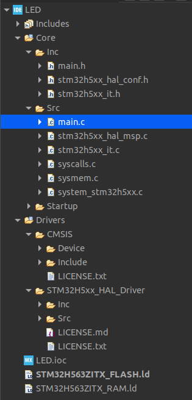

# 🧰 Conoce tu Espacio de Trabajo

[(Volver al Indice)](https://github.com/JossueE/Mastering-STM32/tree/main?tab=readme-ov-file#%C3%ADndice)

---

Si vienes del anterior capítulo, notarás que ya hemos configurado la placa y generado nuestro código. Antes de comenzar a desarrollar, es importante conocer cómo se organiza tu **entorno de trabajo** dentro de **STM32CubeIDE**. Bajo el cual estaremos programando, si vienes de IDE más sencillos. Ver tantos archivos y herramientas puede llegar asustar. Pero recuerda que solo están para facilitarnos la vida.

Este espacio será donde se almacenen todos tus proyectos, configuraciones, archivos generados automáticamente y dependencias del compilador.  
Comprender su estructura te permitirá mantener tus proyectos ordenados y evitar errores al compilar o vincular archivos.

---

## 📖 Partes del Capítulo

- [📁 1. Carpetas principales del proyecto](https://github.com/JossueE/Mastering-STM32/blob/main/Files/iniciar_proyecto/tu_espacio_trabajo.md#1-carpetas-principales-del-proyecto)
- [🧠 2. Estructura del Código Generado (`main.c`)](https://github.com/JossueE/Mastering-STM32/blob/main/Files/iniciar_proyecto/tu_espacio_trabajo.md#-2-estructura-del-c%C3%B3digo-generado-mainc)
- [🔧 3. Herramientas del Entorno](https://github.com/JossueE/Mastering-STM32/blob/main/Files/iniciar_proyecto/tu_espacio_trabajo.md#-herramientas-del-entorno)
  - [1. Compilación del Proyecto (Build)](https://github.com/JossueE/Mastering-STM32/blob/main/Files/iniciar_proyecto/tu_espacio_trabajo.md#1-compilaci%C3%B3n-del-proyecto-build)
  - [2. Depuración (Debug)](https://github.com/JossueE/Mastering-STM32/blob/main/Files/iniciar_proyecto/tu_espacio_trabajo.md#2-depuraci%C3%B3n-debug)
  - [3. Ventana Serial (Terminal UART)](https://github.com/JossueE/Mastering-STM32/blob/main/Files/iniciar_proyecto/tu_espacio_trabajo.md#3-ventana-serial-terminal-uart)

---

## 📁 1. Carpetas principales del proyecto


Cuando presionas **Generate Code** en el archivo `.ioc`, STM32CubeIDE crea automáticamente la estructura completa de tu proyecto en lenguaje C/C++.  
Esta estructura contiene los archivos necesarios para compilar, inicializar periféricos y ejecutar tu programa en el microcontrolador.

A continuación, veremos cada parte del proyecto y su función principal.

| Carpeta / Archivo | Descripción breve |
|--------------------|------------------|
| **Core/** | Contiene el núcleo del programa. Dentro encontrarás `Src/` (archivos `.c`) y `Inc/` (archivos `.h`). Aquí vive tu `main.c`, donde comienza la ejecución. |
| **Drivers/** | Incluye las librerías de ST necesarias para controlar el hardware. Contiene la **HAL (Hardware Abstraction Layer)** y los archivos de **CMSIS** (estándar de ARM). |
| **Startup/** | Define cómo arranca el microcontrolador (vector de interrupciones y reset handler). |
| **.ioc** | Archivo maestro del proyecto. Guarda la configuración de pines, relojes y periféricos. Si lo modificas y presionas *Generate Code*, todo el código se actualiza automáticamente. |
| **.ld (Linker Scripts)** | Indican al compilador cómo usar la memoria FLASH y RAM del microcontrolador. No necesitas editarlos por el momento. |

<p align="center">
  
  <br>
  <em>Estructura típica de un proyecto dentro del Workspace.</em>
</p>

Cada vez que guardas cambios en el archivo `.ioc`, CubeIDE actualiza automáticamente los archivos base del proyecto.  
Estos archivos contienen la inicialización de periféricos, reloj del sistema y funciones HAL. Esto significa que si nosotros quisieramos activar un protocolo de comunicación, después de haber culminado nuestra configuración. Nuestros archivos de programación se ajustarían de manera automática sin necesidad de involucrarnos en el código. 

| Archivo | Función |
|----------|---------|
| **main.c** | Contiene la función principal `main()` y el bucle infinito del programa. **Lugar en el que programaremos.** |
| **stm32h5xx_hal_msp.c** | Configura los periféricos al nivel de pines y prioridades. |
| **system_stm32h5xx.c** | Inicializa los relojes del sistema (clocks). |
| **stm32h5xx_it.c** | Gestiona las interrupciones (NVIC). |

---

## 🧠 2. Estructura del Código Generado (`main.c`)

Nosotros estaremos trabajando dentro de la carpeta `Core/Src/` en el archivo `main.c`. Cuando STM32CubeIDE genera el código, crea una plantilla organizada con bloques especiales marcados como:

```c
/* USER CODE BEGIN X */
/* USER CODE END X */
```
Estos bloques sirven para **separar el código del usuario** del código **automáticamente generado** por CubeIDE.

| Bloque                                      | Significado                                                                                              |
| ------------------------------------------- | -------------------------------------------------------------------------------------------------------- |
| `/* USER CODE BEGIN Header */`              | Encabezado del archivo. Contiene información de licencia, autor y versión.                               |
| `/* USER CODE BEGIN Includes */`            | Aquí puedes agregar tus propios `#include`, como librerías externas o archivos personalizados.           |
| `/* USER CODE BEGIN PV */`                  | Sección para declarar **variables globales** del usuario.                                                |
| `/* USER CODE BEGIN 0 */`                   | Espacio antes de la función `main()` para código inicial (por ejemplo, configuraciones previas).         |
| `/* USER CODE BEGIN 1 / 2 / 3 */`           | Bloques dentro de `main()` que te permiten agregar lógica antes, durante o después de la inicialización. |
| `/* USER CODE BEGIN WHILE */`               | Dentro del bucle infinito `while(1)`. Aquí irá el **código principal de tu aplicación**.                 |
| `/* USER CODE BEGIN 4 */`                   | Lugar para funciones personalizadas adicionales.                                                         |
| `/* USER CODE BEGIN Error_Handler_Debug */` | Sección para definir qué hacer si ocurre un error crítico (por ejemplo, encender un LED de alerta).      |


> [!IMPORTANT]  
> Cualquier código que escribas **fuera de estos bloques** será **eliminado** si vuelves a generar el código desde el `.ioc`.
> Por eso, **siempre programa dentro de los bloques** `USER CODE BEGIN` y `USER CODE END` para no perder tus cambios.


## 🔧 Herramientas del Entorno

STM32CubeIDE incluye una serie de herramientas integradas que permiten compilar, cargar y depurar tus programas directamente sobre la placa.  
A continuación, se describen las más importantes que utilizarás durante el desarrollo.

<p align="center">
  
  <br>
  <em>Herramientas del espacio de trabajo</em>
</p>

### 1. Compilación del Proyecto (Build)

Antes de ejecutar tu código, es necesario **compilarlo** para convertir los archivos fuente en un programa binario que el microcontrolador pueda entender.

- **Ruta rápida:**  
  Menú superior → **Project → Build Project**  
  o bien, usa el icono del martillo 🔨 en la barra superior.

- **Qué hace:**  
  El compilador convierte tus archivos `.c` y `.h` en código máquina (`.elf`, `.bin` o `.hex`).

- **Resultado:**  
  En la pestaña **Console** (parte inferior del IDE) se mostrará el proceso de compilación.  
  Si aparecen errores o advertencias, deberás corregirlos antes de continuar.

> [!TIP]
> Puedes usar *Project → Clean Project* para eliminar archivos antiguos antes de recompilar si notas comportamientos extraños.


### 2. Depuración (Debug)

El modo **Debug** te permite ejecutar el programa paso a paso, colocar puntos de interrupción (breakpoints) y analizar el comportamiento del microcontrolador en tiempo real.

- **Ruta rápida:**  
  Menú superior → **Run → Debug**  
  o el icono del insecto 🪲 en la barra de herramientas.

- **Qué ocurre:**  
  El IDE carga el código compilado en la memoria de la placa (a través del ST-Link) y abre la vista de depuración.

- **Herramientas útiles dentro del modo Debug:**
  - **Step Into (F5):** entra dentro de una función.  
  - **Step Over (F6):** ejecuta una línea completa sin entrar en las funciones internas.  
  - **Resume (F8):** continúa la ejecución normal después de un breakpoint.  
  - **Variables Window:** permite observar el valor actual de las variables y registros.  
  - **Registers:** muestra el contenido interno del procesador.  
  - **Breakpoints:** lista de puntos de interrupción activos.

> [!IMPORTANT]
> Durante la depuración, el microcontrolador se detiene temporalmente. Cuando termines, presiona **Stop** para finalizar la sesión.

### 3. Ventana Serial (Terminal UART)

En STM32 no tenemos una terminal que nos sirva como método de DEBUG. Para ello podemos enviar y recibir información desde la placa (por ejemplo, imprimir mensajes de depuración o datos de sensores), puedes usar la **ventana serial integrada** en CubeIDE.

**Activación:**
1. Menú superior → **Window → Show View → Other...**
2. Busca: **Terminal → Terminal**
3. Selecciona el puerto correspondiente (por ejemplo, `/dev/ttyACM0` o `COM3`).
4. Configura la velocidad (baud rate), generalmente **115200 bps**.
5. Presiona **Connect**.

EN REVISIOOOOOOOOOOOOOOOOOOOOOOOOOOOOOOOOOOOOOOOOOOOOOOOOOOOON 

---

Con esto ya comprendes la estructura básica del **Workspace** y cómo STM32CubeIDE organiza tus proyectos.  
En el siguiente capítulo aprenderás a **crear tu primer proyecto desde cero** y configurar los pines, periféricos y relojes de tu microcontrolador STM32. ⚡  

[(Ver siguiente capítulo: GPIO)](../../Files/GPIO/GPIO.md)
