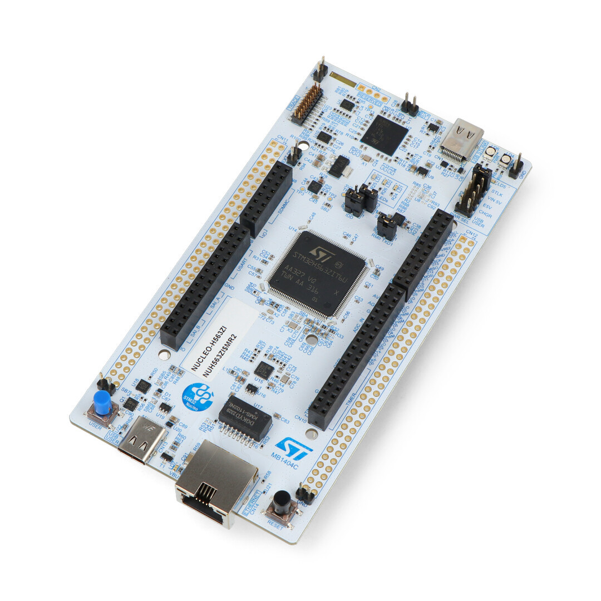

# Mastering STM32 *(versión en Español)*

## 👋 Hola! Soy Jossue Espinoza.

Estoy creando esta guía porque, al igual que tú, alguna vez tuve curiosidad por la familia de microcontroladores **STM32**. Sin embargo, muchas guías disponibles en internet suelen ser confusas, incompletas o excesivamente técnicas. Mi propósito es ofrecerte una **ruta clara y práctica** para que aprendas a usar los componentes esenciales y desarrolles **tu primer proyecto funcional con STM32**, paso a paso. Quiero ayudarte a romper la barrera de entrada a esta poderosa familia de microcontroladores y que descubras por qué es una de las más utilizadas en el mundo **industrial y embebido**.

---
[(Ir al Indice)](Indice.md)

<figure style="margin:0; text-align:center; border:1px solid #eaecef; padding:6px; border-radius:6px;">
  
  <figcaption style="font-size:0.9em; color:#6a737d; margin-top:4px;">
    NUCLEO-H563ZI (STM32) — vista general de la placa.
  </figcaption>
</figure>

## Introducción 

Si ya tienes experiencia en **sistemas embebidos** y has trabajado con **Arduino o ESP32**, notarás que trabajar con **STM32** es una experiencia distinta.
Esto se debe a que los STM32 utilizan núcleos **ARM Cortex-M**, diseñados para ofrecer **procesamiento determinístico, alto rendimiento, bajo consumo energético y gran fidelidad temporal**.

Además, cuentan con **más periféricos** y capacidades avanzadas que los hacen ideales para tareas críticas, como la implementación de **sistemas Hard-RTOS** (tiempo real estricto), manteniendo un **costo comparable o incluso menor** que otras plataformas populares.
Por ello, esta familia de microcontroladores no solo destaca en proyectos académicos o de prototipado, sino que también se utiliza ampliamente en **aplicaciones industriales y profesionales**.

Ahora, quiero ser honesto contigo. Al principio, sentirás que todo requiere **más esfuerzo** que en Arduino o ESP32.
Puede que te frustres cuando veas que una ESP32 parece hacer “lo mismo” de forma más sencilla.
Pero debes recordar que el STM32 **no es solo una tarjeta de desarrollo**, sino un **microcontrolador industrial** diseñado para ofrecer control total sobre el hardware.

Esa complejidad adicional es justamente lo que lo hace tan poderoso.
Al comienzo, las diferencias pueden parecer pequeñas, pero a medida que tus proyectos crezcan en **exigencia, precisión y complejidad**, apreciarás que esa base sólida marca una gran diferencia. 

---
### 